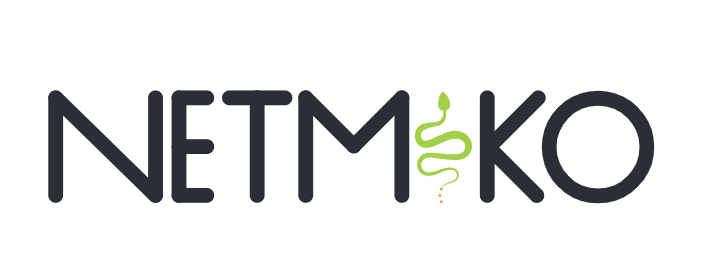

# Network Automation using Python
Network Automation เป็นกระบวนการของการกำหนดค่า การจัดการ การทดสอบ การปรับใช้และการดำเนินงานของอุปกรณ์ทางกายภาพและเสมือนภายในเครือข่ายโดยอัตโนมัติ ด้วยงานและฟังก์ชั่นเครือข่ายในชีวิตประจำวันและฟังก์ชั่นอัตโนมัติ ทำซ้ำกระบวนการควบคุมและจัดการโดยอัตโนมัติ ปรับปรุงความพร้อมใช้งานบริการเครือข่าย

โดยกลุ่มเราเลือก library ที่ชื่อว่า Netmiko ซึ่งเป็น library บนภาษา python เหตุผลที่เลือก library นี้คือเป็นการ access ผ่านโปโตคอล SSH ซึ่งมีความปลอดภัยด้วยการเข้ารหัสข้อความ
เรานำ library ตัวนี้มาใช้ในการ แสดงข้อมูลอุปกรณ์ การเชื่อมต่ออุปกรณ์ และการเปลี่ยนแปลงการตั้งค่าของอุปกรณ์
# Netmiko
Netmiko เป็นlibraryบนภาษา python ที่ไม่เสียค่าใช้จ่าย มีการ access ผ่านโปโตคอล SSH ซึ่งมีความปลอดภัยด้วยการเข้ารหัสข้อความ ใช้การส่งคำสั่งผ่านโค้ดไปที่อุปกรณ์ต่างๆ และ
มีฟังชั่นที่สำเร็จรูปมาแล้วโดยที่เราไม่ต้องสร้างขึ้นมาใหม่สำหรับการส่งคำสั่งเหมือนกับ telnetlib
* simple connection
* display information of device
* basic configuration command
# Video
https://youtu.be/ds2hbvvSZWw
# Document
https://drive.google.com/file/d/1a4fvI6nCydUBNMvqYYB9y3dloQ5ru1u9/view?usp=sharing
# Member
|ชื่อ-นามสกุล|รหัสนักศึกษา|
|----------|-----------|
|1.นางสาวธรรมรัตน์ หาญประสพ|61070083|
|2.นางสาวสรัลชนา ยิ้วประพันธ์|61070236|
|3.นายเสฎฐวุฒิ แซ่อึ๊ง|61070254|
|4.นายอันดามันต์ อุดมชาติ|61070266|
|5.นางสาวภัศจิรา สุขนาบูรณ์|61070344|
